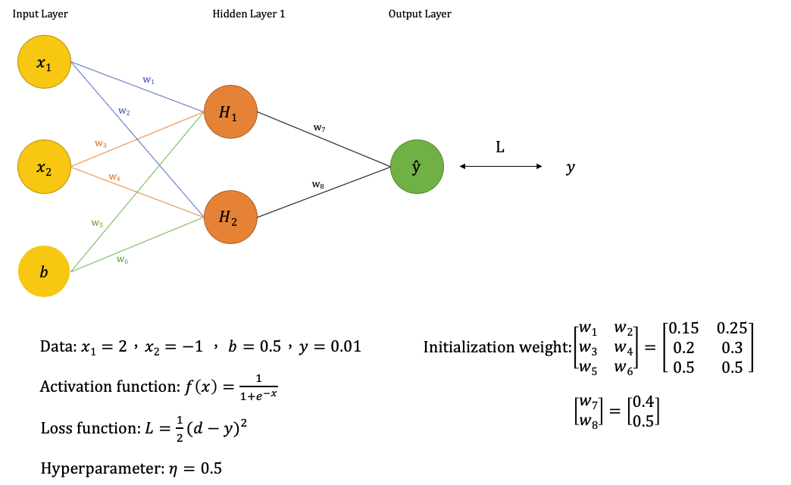
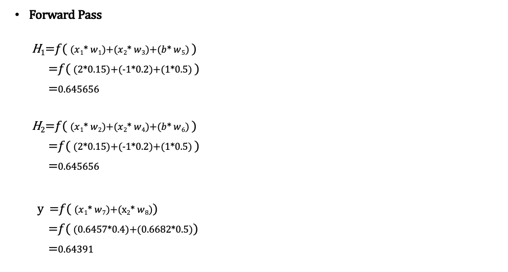
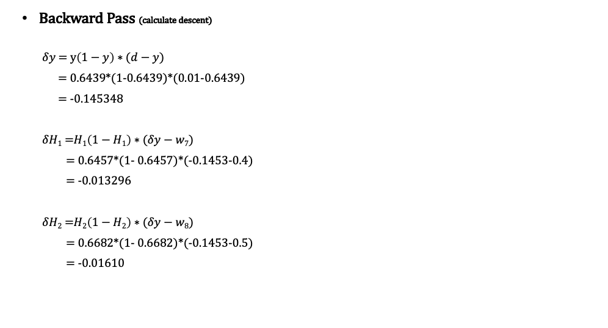
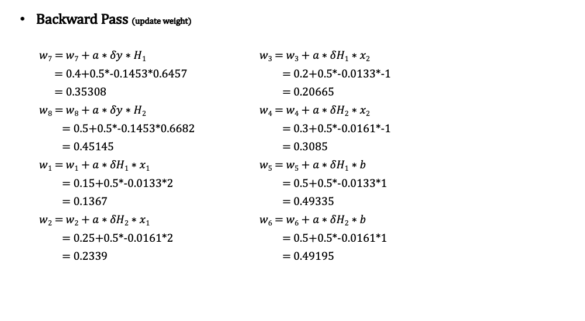
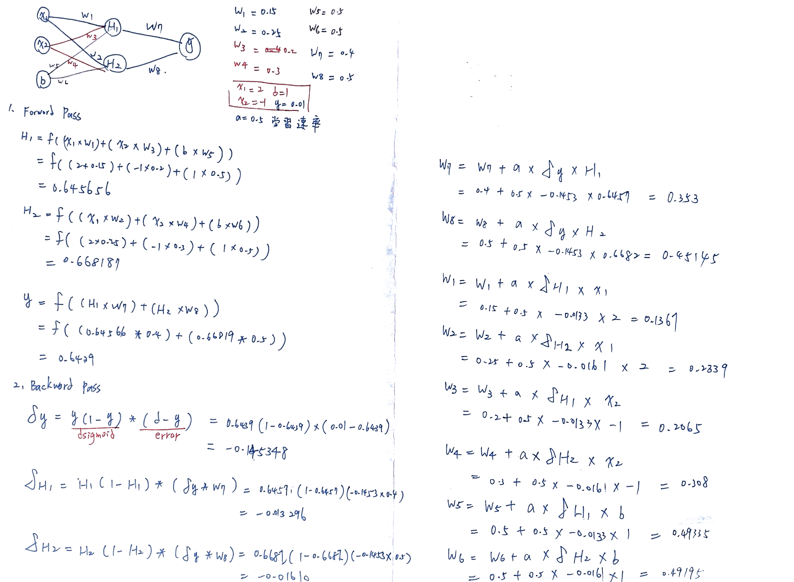

# 手算&手刻神經網路
以下範例建立兩層神經網路，分別為一個隱藏層(hidden layer)以及輸出層(output layer)。輸入有兩個分別為x1、x2另外加上一個偏權值b(bias)。以及一個輸出y。

##  手算筆記

### Reference
[類神經網路 筆記](https://darren1231.pixnet.net/blog/post/338810666-%E9%A1%9E%E7%A5%9E%E7%B6%93%E7%B6%B2%E8%B7%AF%28backpropagation%29-%E7%AD%86%E8%A8%98)

[Back-propagation倒傳遞](https://medium.com/ai-academy-taiwan/back-propagation-3946e8ed8c55)

[類神經網路](https://ccckmit.github.io/aibook/book/book.html#%E4%BD%95%E8%AC%82%E4%BA%BA%E5%B7%A5%E6%99%BA%E6%85%A7-ai)

[Python NN 程式](http://arctrix.com/nas/python/bpnn.py)
